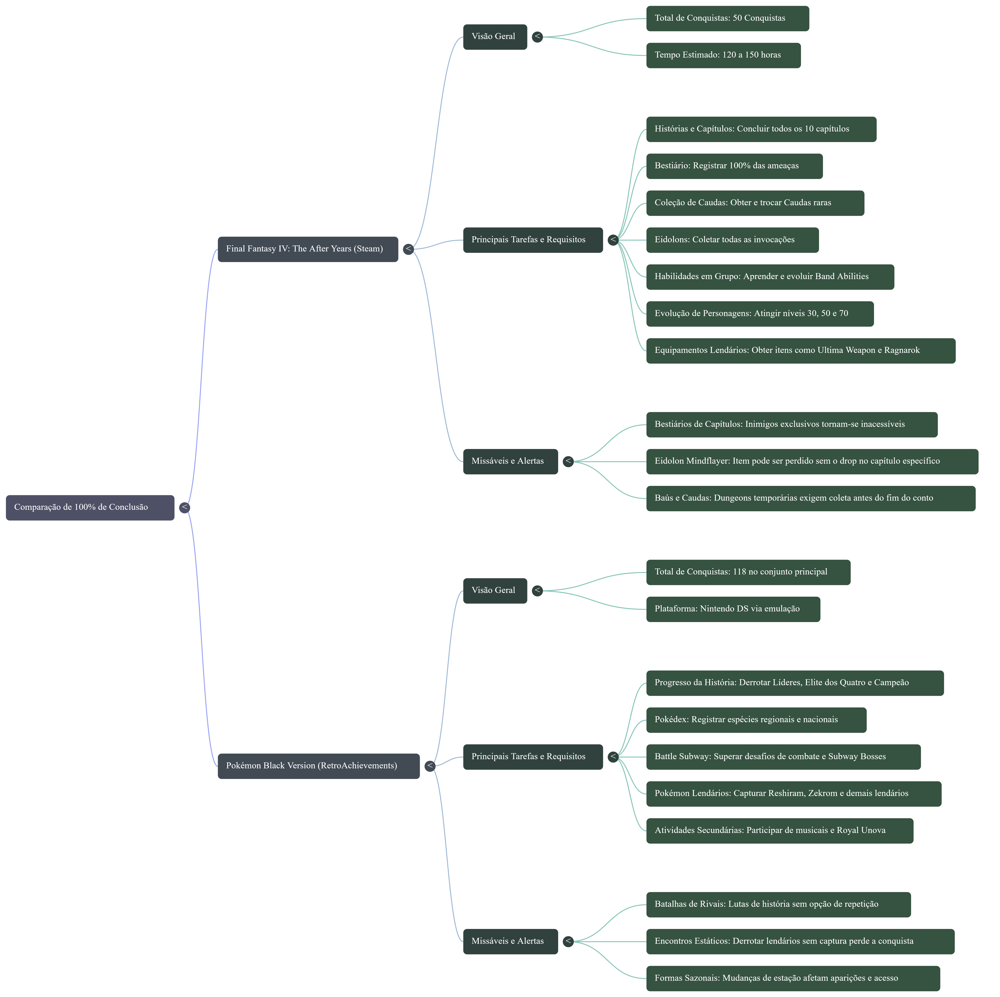

# 🎮 IA como Assistente para Pesquisa de Guias de Conquistas de Jogos

Projeto desenvolvido como parte do desafio **Treinando uma IA de Aprendizagem: Explore o Poder do NotebookLM**, da DIO.

A proposta foi utilizar o **NotebookLM** como um assistente de pesquisa especializado em conquistas, troféus e requisitos de conclusão de videogames, utilizando fontes externas para fundamentar as respostas.

---

## 📌 Sobre o projeto

Durante a conclusão de jogos, especialmente quando o objetivo é obter 100% das conquistas ou troféus, é comum precisar consultar diversos guias, wikis, vídeos e discussões da comunidade.

Isso pode tornar a pesquisa demorada e dificultar a identificação de informações importantes, como:

- conquistas e troféus;
- requisitos específicos;
- conteúdos perdíveis (*missables*);
- coletáveis;
- requisitos de conclusão;
- diferenças entre plataformas;
- informações específicas de sistemas como Steam e RetroAchievements.

A partir desse problema, foi criado um notebook no NotebookLM com o objetivo de funcionar como um **assistente de pesquisa para guias de conquistas de jogos**.

A ideia não é substituir os guias originais, mas facilitar a pesquisa e organizar as informações encontradas neles.

---

## 🎯 Objetivo

Criar um assistente capaz de responder perguntas relacionadas à conclusão de jogos utilizando exclusivamente as fontes disponíveis no notebook, mantendo as respostas rastreáveis e evitando que informações sejam inventadas quando não houver evidências suficientes.

O projeto também buscou testar como uma IA fundamentada em fontes pode auxiliar na pesquisa de diferentes jogos, plataformas e sistemas de conquistas.

---

## 🧠 Tema escolhido

**IA como assistente para pesquisa de guias de conquistas de jogos**

O tema foi escolhido a partir de uma necessidade prática: durante a busca por conquistas e troféus, muitas vezes é necessário consultar várias fontes diferentes para descobrir requisitos, conteúdos perdíveis e detalhes específicos de cada jogo.

A proposta foi utilizar o NotebookLM para centralizar essa pesquisa e verificar se uma IA baseada em fontes poderia tornar esse processo mais organizado.

---

## 📚 Fontes utilizadas

Foram adicionadas diferentes fontes relacionadas à pesquisa de jogos e conquistas, buscando representar diferentes tipos de informação.

| Fonte | Utilização |
|---|---|
| GameFAQs | Walkthroughs e informações gerais sobre jogos |
| PowerPyx | Guias de troféus, conquistas e conteúdos perdíveis |
| Steam Community | Guias e informações produzidas pela comunidade |
| RetroAchievements | Informações sobre conjuntos de conquistas de jogos retrô |
| YouTube | Guias visuais e demonstrações de procedimentos |
| Outras fontes de guias | Complementação e comparação de informações |

A utilização de fontes diferentes foi importante para testar a capacidade do NotebookLM de comparar informações e identificar possíveis divergências.

---

## ⚙️ Diretiva personalizada

Para controlar o comportamento do assistente, foi criada uma diretiva personalizada:

> Você é um assistente especializado em pesquisa de guias, conquistas, troféus e conteúdo necessário para completar jogos.
>
> Utilize exclusivamente as fontes disponíveis neste notebook para responder às perguntas. Não invente informações nem complete lacunas com conhecimento externo.
>
> Ao responder:
>
> - indique claramente de qual fonte cada informação foi obtida;
> - priorize informações diretamente relacionadas ao jogo e à pergunta realizada;
> - diferencie conquistas/troféus, itens, coletáveis, missões, eventos e outros requisitos de conclusão;
> - destaque conteúdos perdíveis (missable) e requisitos que precisam ser cumpridos antes de determinado ponto do jogo;
> - quando duas ou mais fontes apresentarem informações diferentes, não escolha uma delas arbitrariamente: apresente a divergência e indique quais fontes sustentam cada informação;
> - se as fontes disponíveis não forem suficientes para responder, informe que não há evidências suficientes nas fontes, em vez de presumir ou inventar uma resposta.
>
> Sempre que possível, organize as informações de maneira clara, utilizando listas ou tabelas quando isso facilitar a consulta.
>
> Não presuma que uma informação válida para uma versão, plataforma, edição ou conjunto de conquistas seja válida para outra. Quando houver diferenças entre versões, plataformas ou sistemas de conquistas, destaque-as.

---

## 🔎 Testes realizados

Para avaliar o comportamento do assistente, foram realizados testes utilizando diferentes jogos e sistemas de conquistas.

### Teste 1 — Fontes inicialmente insuficientes

Foi realizada uma pergunta envolvendo:

- **Final Fantasy IV: The After Years — Steam**
- **Pokémon Black Version — RetroAchievements**

Inicialmente, o NotebookLM informou que as fontes disponíveis não eram suficientes para responder com segurança a todas as perguntas específicas.

Esse comportamento foi considerado positivo, pois a diretiva determina que o assistente não deve inventar informações quando não existem evidências suficientes nas fontes.

---

### Teste 2 — Pesquisa adicional

Foi utilizada a função de pesquisa do NotebookLM para encontrar informações adicionais relacionadas aos jogos.

Após a pesquisa, foram incorporadas novas fontes ao contexto e as perguntas foram realizadas novamente.

Com isso, o NotebookLM conseguiu apresentar informações mais específicas sobre:

- requisitos de conclusão;
- conquistas;
- conteúdos perdíveis;
- coletáveis;
- requisitos de progressão;
- diferenças entre sistemas de conquistas.

---

### Teste 3 — Comparação entre plataformas

Os dois casos de teste utilizam sistemas diferentes:

**Final Fantasy IV: The After Years**
- Plataforma: Steam
- Sistema: conquistas da Steam
- Total: 50 conquistas

**Pokémon Black Version**
- Plataforma original: Nintendo DS
- Sistema utilizado no projeto: RetroAchievements
- Total do conjunto utilizado no teste: 118 conquistas

Essa comparação permitiu observar a importância de considerar a plataforma e o sistema de conquistas antes de utilizar uma informação encontrada em um guia.

---

### Teste 4 — Validação das respostas

As respostas geradas pelo NotebookLM não foram consideradas automaticamente corretas.

As informações foram comparadas com as fontes utilizadas para identificar possíveis divergências, principalmente em relação a conteúdos perdíveis e requisitos específicos.

Esse processo mostrou que a utilização de IA para pesquisa não elimina a necessidade de verificar as informações nas fontes originais.

---

## 🗺️ Materiais gerados

Durante o desenvolvimento do projeto foram utilizados os recursos de geração de materiais disponíveis no NotebookLM.

### Mapa mental

O mapa mental apresenta uma comparação dos requisitos de conclusão dos dois jogos utilizados nos testes.

---

### Apresentação

Também foi criada uma apresentação resumindo a proposta, o funcionamento do notebook e os resultados dos testes.

O arquivo pode ser encontrado em:

📁 `materiais/apresentacao.pdf`

---

## 💡 Resultados

O projeto demonstrou que o NotebookLM pode ser utilizado como uma ferramenta auxiliar para pesquisas relacionadas a conquistas e troféus.

Entre os pontos positivos observados:

- centralização de diferentes fontes;
- possibilidade de realizar perguntas diretamente sobre o conteúdo pesquisado;
- identificação de requisitos específicos;
- comparação entre informações de diferentes fontes;
- organização das informações em materiais como mapas e apresentações;
- redução da necessidade de consultar manualmente várias fontes ao mesmo tempo.

Por outro lado, também foi possível observar algumas limitações:

- a qualidade das respostas depende das fontes disponíveis;
- informações específicas podem exigir pesquisa adicional;
- diferentes fontes podem apresentar informações conflitantes;
- materiais gerados automaticamente precisam ser revisados;
- limites de uso podem restringir alguns recursos da ferramenta.

---

## 🧪 Conclusão

O desenvolvimento deste projeto mostrou que uma IA fundamentada em fontes pode ser útil como ferramenta de apoio à pesquisa de conquistas e troféus.

O principal benefício observado foi a possibilidade de transformar várias fontes diferentes em um espaço único de consulta, permitindo fazer perguntas e comparar informações sem abandonar completamente as fontes originais.

Entretanto, a experiência também reforçou a importância da **verificação das informações geradas pela IA**. O NotebookLM pode organizar e relacionar conteúdos de maneira eficiente, mas a confiabilidade das respostas continua diretamente relacionada à qualidade das fontes utilizadas.

Dessa forma, a proposta não é utilizar a IA como substituta dos guias, mas como uma **camada de organização e pesquisa sobre eles**.

---

## 🛠️ Ferramentas utilizadas

- [NotebookLM](https://notebooklm.google.com/)
- Google Gemini/recursos de IA integrados ao NotebookLM
- GitHub
- DIO

---

## 📖 Projeto

Projeto desenvolvido para fins educacionais como parte da formação da DIO.

**Tema:** IA como assistente para pesquisa de guias de conquistas de jogos  
**Ferramenta principal:** NotebookLM
